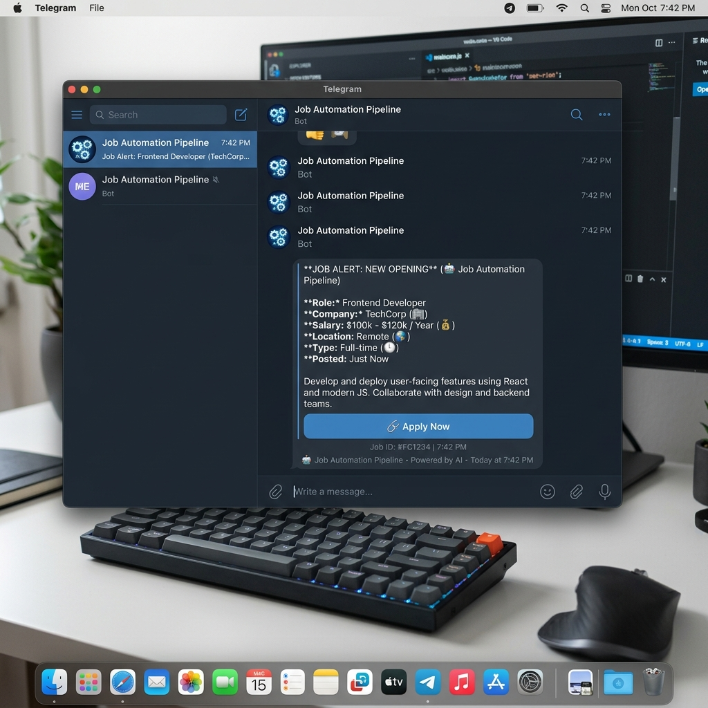

# Job Automation Pipeline ⚙️🤖

An intelligent, fully automated job aggregation and evaluation pipeline built to scout entry-level software development roles for freshers. This pipeline automatically scrapes, evaluates, and filters job postings, delivering only the highest-quality, relevant matches straight to your Telegram.

---

## 🚀 Vision & Key Highlights

- **Zero-Touch Operation**: Runs entirely on a schedule via n8n, requiring no manual intervention.
- **Smart Filtering**: Uses Google Gemini to act as an AI recruiter, reading the actual Job Description and filtering out senior roles, non-development jobs, or unsupported tech stacks.
- **Automated De-duplication**: Connects to Google Sheets to remember every job it has seen, ensuring you never get duplicate alerts.
- **Instant Alerts**: Posts cleanly formatted job summaries (Role, Company, Salary, Location, Link) directly to your Telegram immediately after evaluation.

---

## ✨ How It Works (The Pipeline)

1. **Source Aggregation**: Periodically pulls raw job postings from major ATS platforms (Greenhouse, Lever) and remote job boards (Remotive).
2. **Deep Scraping (Firecrawl)**: When a new job is found, it uses Firecrawl to scrape the dynamic career page and extract the full Job Description as clean Markdown.
3. **AI Decision Engine**: Gemini reads the Markdown JD and checks it against strict eligibility criteria (e.g., 0-1 years experience, India/Remote, dev-focused). 
4. **Data Logging**: The job URL and evaluation result are logged into a Google Sheet (`SeenJobs`) so it is never processed again.
5. **Notification**: If the AI approves the job, a Telegram bot fires a message to your phone with the job details.

---

## 🛠️ Technology Stack

| Component | Technology |
|---|---|
| **Orchestration** | n8n (Node-based automation) |
| **AI Decision Engine** | Google Gemini API |
| **Web Scraper** | Firecrawl API (Markdown extraction) |
| **Database/Log** | Google Sheets API |
| **Notifications** | Telegram Bot API |

---

## 📁 Core Files & Code Structure

- `workflow.json`: The core export of the n8n pipeline. This JSON file contains all the node connections, JavaScript transformation logic, AI prompt configurations, and API integrations.
- `Google Sheets (Cloud)`: Acts as the persistent database (`CareerPages` for targets, `SeenJobs` for logs).

---

## 🚀 Getting Started

### 1. Google Sheets Configuration
Create a Google Sheet with two sub-sheets:
- **`CareerPages`**: For storing target URLs.
  - Columns: `company`, `URL`, `active` (boolean)
- **`SeenJobs`**: For logging evaluated job links.
  - Columns: `job_url`, `job_title`, `company`, `source`, `date_found`

### 2. Required Credentials in n8n
- **Google Sheets OAuth2 API**: For reading targets and logging seen jobs.
- **Google Gemini API**: For evaluating the Job Descriptions.
- **Telegram Bot API**: Bot token and your Chat ID for receiving channel alerts.
- **Firecrawl API Key**: Configured via environment variable (`FIRECRAWL_KEY`) or direct headers.

### 3. Import the Pipeline
1. Clone this repository.
2. Open your **n8n canvas**.
3. Go to **Import from File** and upload the `workflow.json` file.
4. Re-link your credentials to the respective nodes, enable the webhook/cron trigger, and activate the workflow!

---

## 📜 License
Educational and personal use. © 2026 Bhushan Damisetti. All rights reserved.
